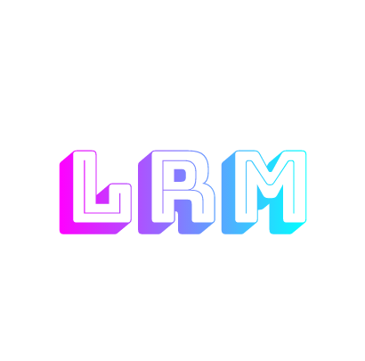

# Light Reflective Mirror

LRM Node / MultiCompiled

 

LoadBalancer 

 

Unity Package

## What
Light Reflective Mirror is a transport for Mirror Networking which relays network traffic through your own servers. This allows you to have clients host game servers and not worry about NAT/Port Forwarding, etc. There are still features I plan on adding but it still is completely stable in its current state.

## Features
* WebGL Support, WebGL can host servers!
* Built in server list!
* Relay password to stop other games from stealing your precious relay!
* Relay supports connecting users without them needing to port forward!
* NAT Punchtrough (Full Cone, Restricted Cone, and Port Restricted Cone)
* Direct Connecting
* Load Balancing with multi-relay setup

## How does it work?

I took a bit of a unique approach to this version and instead of using one fixed net library for the game to communicate with the standalone relay server, I instead made it use any of mirrors transports! This allows you to make it work with websockets, Ignorance(ENET), LiteNetLib, and all the others!

## Known Issues/Flaws

Disconnects from the relay will not auto reconnect **yet**. So a dedicated host is extremely recommended! Or implement your own logic to auto reconnect.

## Tutorials

(I recommend these over the text format)

### How to setup LRM on an ubuntu server
https://www.youtube.com/watch?v=0SpKIs0Beuo

### How to setup LRM in unity, along with basic usage
https://www.youtube.com/watch?v=Wi0rp2b8KmM

## Usage

Now for the juicy part, using it. Like I mentioned in the 'What' section, this is a prototype so if theres problems, please report them to me. Also PRs are also always welcomed! :)

First things first, you will need:
* Mirror, Install that from Asset Store.
* Download the latest release of Light Reflective Mirror Unity Package and put that in your project also. Download from: [Releases](https://github.com/Derek-R-S/Light-Reflective-Mirror/releases).
* Download JSON.Net from the asset store. (It's free)

#### Client Setup
Running a client is fairly straight forward, attach the LightReflectiveMirrorTransport script to your NetworkManager and set it as the transport. Put in the IP/Port of your relay server, assign LightReflectiveMirror as the Transport on the NetworkManager. Then attach the SimpleWebTransport script and assign that in the 'ClientToServerTransport' in the Light Reflective Mirror inspector. When you start a server, you can simply get the URI from the transport and use that to connect. If you wish to connect without the URI, the LightReflectiveMirror component has a public "Server ID" field which is what clients would set as the address to connect to. 

If your relay server has a password, enter it in the relayPassword field or else you wont be able to connect. By default the relays have the password as "Secret Auth Key".

##### Server List

Light Reflective Mirror has a built in room/server list if you would like to use it. To use it you need to set all the values in the 'Server Data' tab in the transport. Also if you would like to make the server show on the list, make sure "Is Public Server" is checked. Once you create a server, you can update those variables from the "UpdateRoomInfo" function on the LightReflectiveMirrorTransport script.

To request the server list you need a reference to the LightReflectiveMirrorTransport from your script and call 'RequestServerList()'. This will invoke a request to the server to update our server list. Once the response is recieved the field 'relayServerList' will be populated and you can get all the servers from there.
 
#### Server Setup
Download the latest Server release from: [Releases](https://github.com/Derek-R-S/Light-Reflective-Mirror/releases)
Make sure you have .NET Core 5.0
And all you need to do is run LRM.exe on windows, or "dotnet LRM.dll" on linux!

#### Server Config
In the config.json file there are a few fields.

TransportDLL - This is the name of the dll of the compiled transport dll.

TransportClass - The class name of the transport inside the DLL, Including namespaces!
By default, there are 5 compiled transports in the MultiCompiled dll.
To switch between them you have the following options:

* Mirror.TelepathyTransport
* kcp2k.KcpTransport
* Mirror.SimpleWebTransport

AuthenticationKey - This is the key the clients need to have on their inspector. It cannot be blank.

UpdateLoopTime - The time in miliseconds between calling 'Update' on the transport

UpdateHeartbeatInterval - the amounts of update calls before sending a heartbeat. By default its 100, which if updateLoopTime is 10, means every (10 * 100 = 1000ms) it will send out a heartbeat.

## Example

Maqsoom's Server List Example - https://github.com/maqsoom/LightReflectiveMirror-Example

## What to choose, Epic, Steam, LRM?

There are quiet a few relay transports for mirror at this point, It can often be difficult to pick one that most suits your needs. So I'll quickly go over my view on it and hopefully it helps you make an informed decision.

### Steam
Starting with steam, steam offers a free relay with NAT punchthrough for anyone releasing a game on steam. This integrates into their lobby invites and also only allows connections from other users who actually own the game (No pirates sneaking into your servers!) and it works wonders. Steam has well documented SDK, a huge community, and they are active on their forums. If you plan on releasing on steam and only steam, go with this. To get the steam relay, go into the #steam channel in mirror's discord and use whichever one is the same as your wrapper.

### Epic
Epic is a newer transport that offers NAT Punchthrough, and a relay service for free. As of writing this its only available for usage on Windows/Mac/Linux (More platforms are planned and releasing in the future). This one is great because they offer it for free! Thats right, a free relay and NAT punchthrough server, plus more! They have more tools such as Matchmaking, server browser, statistics, and more! This is NOT locked into only releasing on Epic Store, like how steams is. So you can release on any store you want if your game uses this. Now onto the downsides, they have a very PITA SDK to use with a fairly small community for the C# side of things. (FakeByte helps alot in the discord and will help with features outside of the relay transport!). The documentation is sub-par and severely lacking in some places, which is expected as its fairly new. They also have Epic Account Services, which is similar to steams but like the relay, not locked into one store! With those services you get user accounts, In game purchases, achievements, and much more. So if you want a free relay/NAT Punchthrough server, and want to go along for the ride of EoS, this is the one. You cant beat free. :P Check it out [here](https://github.com/FakeByte/EpicOnlineTransport)

### LRM
LRM is a self-hosted, open source, relay/NAT Punchthrough server. It's available for all platforms (PC, Mac, Linux, WebGL, Android, IOS, You name it!). It does this by supporting any of mirrors existing transports. If you want webgl? Use websockets! Want TCP? Telepathy! UDP? KCP! This is one of LRM's main features. The game developer can decide on how they want their data sent between the server and clients. With LRM, you are going to have to host the servers yourself. We are releasing a load balancer soon which will make it super easy to expand servers in regions and balance users out between them. The more powerful of a server you have, the more that LRM node can host. With some tests (All clients relayed, none NAT punched), we could get about ~200 CCU on a $5 google cloud server (f1-micro). Though, LRM is still constantly being worked on and could have changes, rewrites, etc at any time. You are able to contribute if you find any bugs, just by opening a PR! So, if you are more of a self-hosting person, who wants full control of your servers, or want a relay for a platform the others don't support (WebGL). Use LRM, if you have any questions, we are in the discord channel everyday! :)

## Credits

Cooper - Assisted with development and made some wonderful features! He's also active in the discord to help answer questions and help with issues.

Maqsoom & JesusLuvsYooh - Both really active testers and have been testing it since I pitched the idea. They tested almost all versions of DRM and I am sure they will test the crap out of LRM!

All Mirror Transport Creators! - They made all the transports that this thing relies on! Especially the Simple Web Transport by default!

## License
[MIT](https://choosealicense.com/licenses/mit/)
